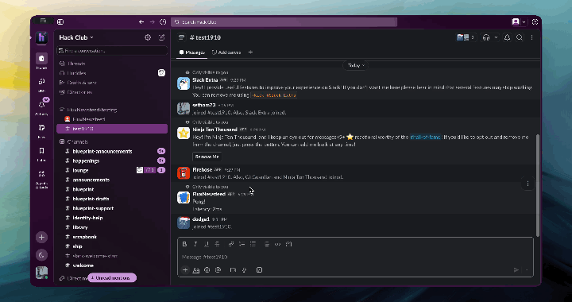

# Flux-Newsfeed

   

## Description

Flux-Newsfeed is a bot built for Slack, uses .js files with commands, fetching news from the https://gnews.io api for research and experimental use. 

## Deployed at Slack (also available in HackClubs Server)

--tbd--

Done! Try now in my public slack testing channel: https://hackclub.enterprise.slack.com/archives/C0C18L17YBA



## Prerequirements

- Node.js installed

```bash

# 1. Clone the repository
git clone https://github.com/TheDoctor200/Flux-Newsfeed.git

# 2.
npm init -y
npm install @slack/bolt dotenv

# 3.
node index.js

```

## Project Structure

```
.
├── node_modules
├── .env
├── .gitgnore
├── a couple of fetch... .js files
├── index.js
├── package-lock.json
├── package.json
└── README.md
```

## Contributors

Only me :)
